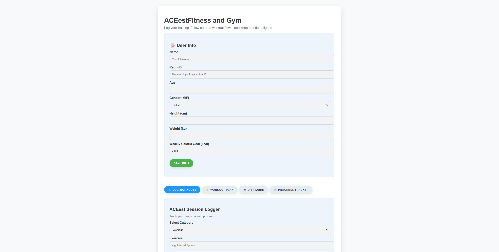
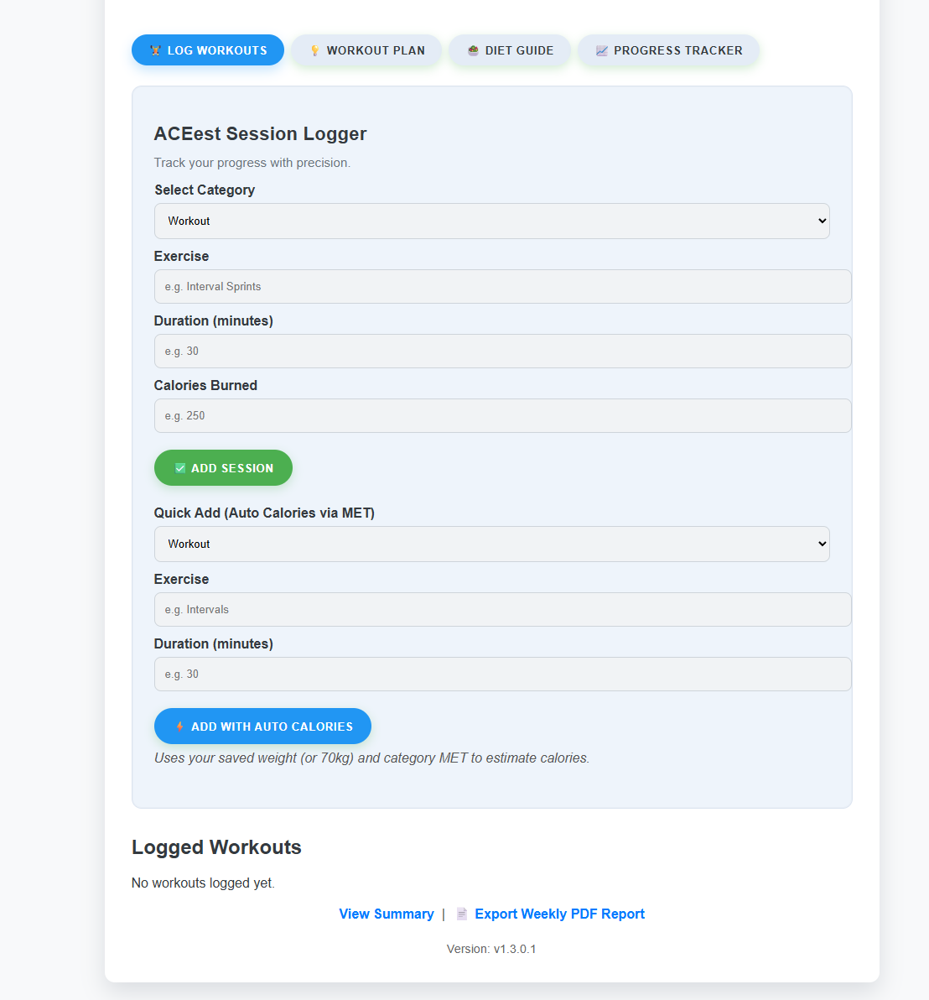
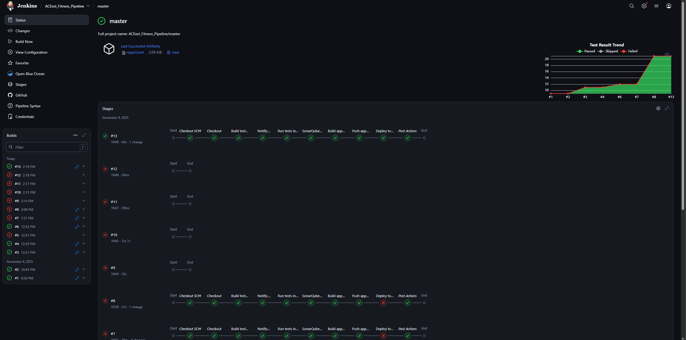

# 🏋️‍♂️ ACEest Fitness & Gym Management System

[](http://52.238.241.103/)

<!-- Badges -->
[](https://github.com/IonMind/ACEest_Fitness_Py/releases)


A modern Flask web application for tracking workouts, workout time, and calories burned. Designed for fitness enthusiasts and gym managers to easily log and visualize workout data. Includes automated testing and a Jenkins-based CI/CD pipeline targeting Azure Kubernetes Service (AKS).

---

## 📑 Table of Contents
- [✨ Features](#-features)
- [🛠️ Setup & Run Locally](#️-setup--run-locally)
- [🧪 Running Tests](#-running-tests)
- [🐳 Docker Usage](#-docker-usage)
- [🔄 Jenkins CI/CD](#-jenkins-cicd)
- [📂 Project Structure](#-project-structure)
- [🧰 Technologies Used](#-technologies-used)
- [🤝 Contributing](#-contributing)
- [📄 License](#-license)

---

## ✨ Features
- 📝 Add workouts: Log workout name, duration (minutes), and calories burned.
- 📋 View workouts: See a list of all logged workouts in a clean, modern interface.
- 📱 Responsive web UI: Simple, beautiful HTML & CSS for desktop and mobile.
- 🐳 Dockerized: Ready to deploy anywhere with Docker.
- ✅ Automated testing and CI/CD pipeline.

---

## �️ How it looks

Below is a screenshot of the ACEest Fitness & Gym web app UI.



---

## �🛠️ Setup & Run Locally

1. **Clone the Repository**
    ```bash
    git clone https://github.com/yourusername/ACEest_Fitness_Py.git
    cd ACEest_Fitness_Py
    ```
2. **Install Dependencies**
    ```bash
    pip install -r requirements.txt
    ```
3. **Run the Application**
    ```bash
    python src/app.py
    ```
    🌐 Visit [http://localhost:5000](http://localhost:5000) in your browser.

---

## 🧪 Running Tests

1. **Install Pytest** (if not already installed)
    ```bash
    pip install pytest
    ```
2. **Run Tests**
    ```bash
    pytest
    ```
    🟢 Test results will be displayed in the terminal.

---

## 🐳 Docker Usage

### Run the App Locally in Docker

Use the included `dockerfile` to build and run the web application without installing Python locally.

```bash
# Build the app image
docker build -t aceest-fitness -f dockerfile .

# Run container (bind port 5000)
docker run --rm -p 5000:5000 --name aceest_app aceest-fitness

# Visit the app
# http://localhost:5000
```

Optional: run in detached mode so you can close the terminal:
```bash
docker run -d --rm -p 5000:5000 --name aceest_app aceest-fitness
```
Stop the container:
```bash
docker stop aceest_app
```

### Run Tests Using `testdockerfile`

The test image isolates dependencies and executes the Pytest suite automatically.

```bash
# Build test image
docker build -t aceest-fitness-test -f testdockerfile .

# Run tests (container exits after completion)
docker run --rm --name aceest_tests aceest-fitness-test
```

If the test image is configured to emit a JUnit/XML report, copy it from the container (example path):
```bash
docker build -t aceest-fitness-test -f testdockerfile .
docker create --name ace_tmp aceest-fitness-test
docker cp ace_tmp:/gym/report.xml ./report.xml
docker rm ace_tmp
```

### Rapid Rebuilds (Caching Tips)
To speed up rebuilds, keep dependency layers early and avoid changing lower layers (like `requirements.txt`) unless necessary. Use `--progress=plain` for verbose build logs if debugging.

---

## 🔄 Jenkins CI/CD

Jenkins URL: http://jenkinsserver.centralus.cloudapp.azure.com:8080/

This repository includes a Jenkins declarative pipeline (see `Jenkinsfile`) that:
- Builds a Docker test image using `testdockerfile` and runs the Pytest suite in a container.
- Publishes JUnit results (`report.xml`) to Jenkins.
- Optionally runs SonarQube analysis if configured on the Jenkins master/agent.
- Builds and tags the application image with a timestamp + build number.
- Pushes the image to a Docker registry using Jenkins credentials.
- Deploys to AKS by applying manifests in `k8s/deployments/` (on `master` branch), then waits for rollout.

Required Jenkins credentials (IDs used in `Jenkinsfile`):
- `githubnotify`: GitHub token for commit status (optional).
- `dockercreds`: Docker Hub username/password.
- `kubeconfig`: Kubernetes config file for the target AKS cluster.

Live App (AKS): http://52.238.241.103/

---

## 📂 Project Structure
```
ACEest_Fitness_Py/
├── dockerfile
├── testdockerfile
├── Jenkinsfile
├── requirements.txt
├── src/
│   └── app.py
├── tests/
│   └── test_app.py
└── k8s/
    └── deployments/
        ├── deployment.yaml
        └── service.yaml
```

---

## 🧰 Technologies Used
- 🐍 Python 3.11+
- ⚡ Flask
- 🎨 HTML & CSS
- 🐳 Docker
- 🧪 Pytest
- 🤖 Jenkins

---

## 🤝 Contributing
Pull requests are welcome! For major changes, please open an issue first to discuss what you would like to change.

---

## 📄 License
This project is licensed under the MIT License.

---
